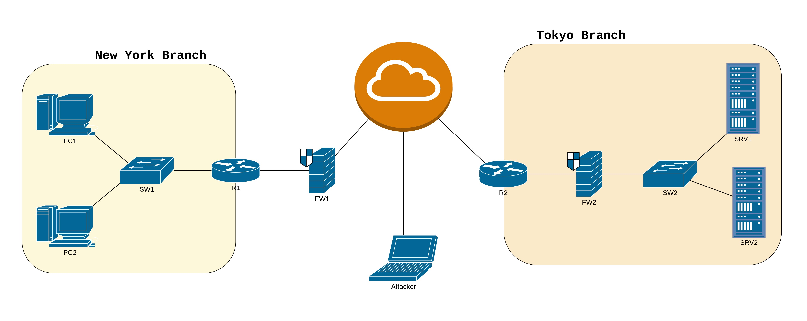

> [Free CCNA v1.1 200-301](../README.md) | [Jeremy's IT Lab](../../README.md) | [Labs](../../../README.md)

# Day 1 - Networking Devices
> Lab 1

> 
  English - ENG  | <a href="dia-1_free-ccna_jeremy's-it-lab_esp.md"> Spanish - ESP<a/>. 

> [PDF version](https://drive.google.com/file/d/1CZ4cNjsbF-jP5xeazkD38fw155iA2bxe/view?usp=sharing).

---

 

## Lab Instructions.

> Create the network diagram displayed at 16:40 of the Day 1 video.
>
> Use the following devices:
>
> Cisco 2911 routers (x2)
>
> Cisco 2960 switches (x2)
>
> Cisco 5505 Firewalls (x2)
>
> PCs (x2)
>
> Servers (x2)
>
> Use a Laptop as the 'attacker' in the diagram.
>
> **Connect the devices together using Packet Tracer's
'Automatically\
 Choose Connection Type' function**.

 

---

 

## Network Topology.
> Network design you should be following to complete the lab.

 

  

 

---

 

## Lab Contents.

- "_.md_" files, main READMEs for the repository, one in English and the other one in Spanish.
- "_.pkt_" file, to be opened in Cisco Packet Tracer. This one contains the full lab already done.
- _attachments_ folder.
    - "_.xml_" file, with the network diagram.
    - "_.jpg_" file, an image of the network diagram we have to do in the lab.

 

---

